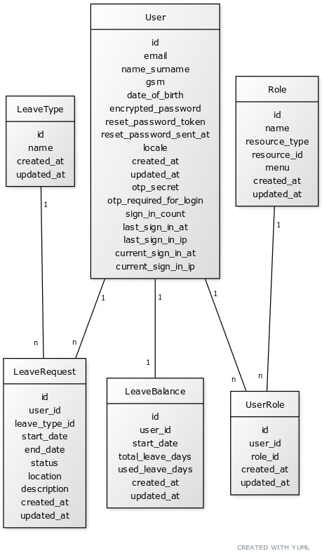

# 🌐 Rails Project Overview - Leave Management System UML Diagram

This Rails application manages employee leave requests, leave balances, and roles, providing a seamless system for tracking and approving time off. Employees can submit leave requests, monitor their leave balances, and administrators can assign roles for access control within the system. Below is a breakdown of the entities and relationships within the application.

## 📂 Entity Descriptions

1. **👤 User**  
   This represents each system user (typically an employee). Key attributes include:
   - **Email** 📧: Contact email for login and communication.
   - **Name** 🏷️: Full name for easy identification.
   - **Phone** 📞: Mobile number for contact purposes.
   - **Date of Birth** 🎂: Birthdate, if needed for employee data.
   - **Authentication** 🔒: Secure login details like `encrypted_password`, `reset_password_token`, etc.
   - **Locale** 🌎: Language preference for user interface.
   - **2FA** 🔐: Two-factor authentication using `otp_secret` and `otp_required_for_login`.

2. **📈 LeaveBalance**  
   Tracks each user's leave details, including:
   - **Total Leave Days** 📅: The total number of days the user can take as leave.
   - **Used Leave Days** ✅: Days already taken by the user.
   Each `User` has one corresponding `LeaveBalance` record to keep these details organized.

3. **🏖️ LeaveType**  
   Defines the various types of leave available, such as vacation, sick leave, or personal days. Each `LeaveRequest` references a `LeaveType`.

4. **📝 LeaveRequest**  
   Stores each leave request made by a user, including:
   - **Start & End Date** 📆: Duration of the requested leave.
   - **Status** 🚦: Current status of the request (e.g., pending, approved, rejected).
   - **Location** 📍: Physical or remote location during leave, if relevant.
   - **Description** 💬: Additional notes regarding the leave.
   Each `User` can have multiple `LeaveRequest` records, and each request is associated with a specific `LeaveType`.

5. **🔑 Role**  
   Represents different roles within the application (e.g., admin, manager, employee), which determine access permissions for various functionalities within the system.

6. **👥 UserRole**  
   Establishes the many-to-many relationship between `User` and `Role`. This structure allows:
   - Each `User` to have multiple `Roles`.
   - Each `Role` to be assigned to multiple users.

## 🔗 Relationships

- **User - LeaveRequest**  
  A one-to-many relationship where a `User` can submit multiple `LeaveRequest` records.

- **User - LeaveBalance**  
  A one-to-one relationship where each `User` has a single `LeaveBalance` record to track their leave details.

- **LeaveType - LeaveRequest**  
  A one-to-many relationship where each `LeaveRequest` references one `LeaveType`, and each `LeaveType` can be associated with multiple requests.

- **User - UserRole - Role**  
  A many-to-many relationship facilitated by `UserRole`. This setup allows:
  - Each `User` to be assigned multiple roles, and
  - Each `Role` to be assigned to multiple users.

With this structure, the application ensures a user-friendly, organized, and role-based system for managing leaves, user roles, and associated access levels.
